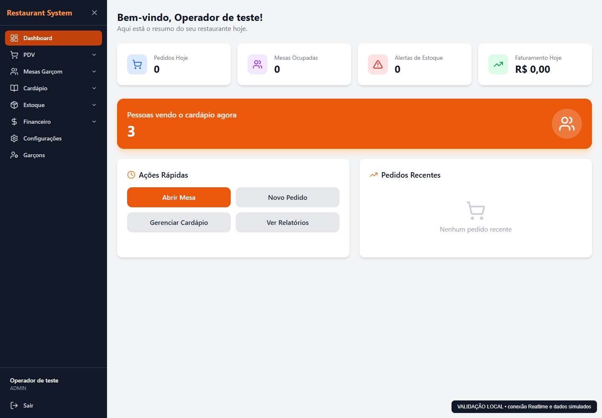
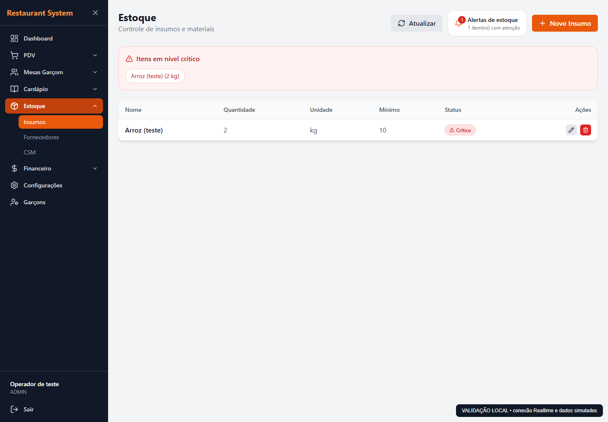

# Validação local de Realtime

Os prints desta pasta foram gerados no navegador com a aplicação e o cliente Supabase 2.105.1 reais, usando respostas HTTP e um servidor de protocolo Realtime simulados. Os dados são fictícios. **Não comprovam a conexão com o projeto Supabase de produção.**

- Dashboard aberto antes do cardápio: três abas produziram a contagem 3; fechar duas reduziu para 1.
- Desconexão simulada: o SDK reconectou e registrou novamente a presença.
- Broadcast: alteração de quantidade refletida na lista; alerta crítico apareceu e desapareceu após reposição.
- Navegação para fora do estoque: a assinatura foi removida e eventos posteriores não recarregaram a tela desmontada.
- Nenhum erro JavaScript não tratado no navegador.

## Testes reproduzíveis

Execute `npm run test:realtime` em `frontend/` (11 testes) e `backend/` (6 testes). Os testes usam dados e credenciais fictícios; não acessam o banco real. Os testes de backend usam transpile-only, pois os tipos de banco são gerados localmente e não são versionados.

O build de produção do frontend e o lint dos módulos novos passaram. A checagem TypeScript isolada do publisher também passou.

## Pendente antes do merge

1. Preencher as duas variáveis públicas indicadas em `frontend/.env.example` e reiniciar o Vite.
2. Validar no Supabase real as três abas, o fechamento de abas, reconexão e a atualização/alerta de estoque entre operadores. Os canais públicos precisam estar permitidos nas configurações de Realtime.
3. Gerar `backend/src/types/database.ts` com o comando `npm run supabase:types` após autenticar a CLI Supabase, e executar `npm run build` no backend. Neste checkout o arquivo está ausente e a CLI não tem access token; o build completo falhou por esse pré-requisito.
4. Conferir os fluxos de pedidos, caixa e fiado e os limites de conexões do projeto.

A confirmação de RLS em todas as tabelas públicas, sem políticas e sem acesso da anon key aos dados, foi fornecida pelo responsável do projeto. Nenhuma política ou configuração remota foi alterada nesta tarefa.
